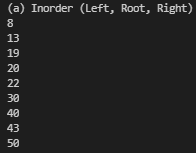
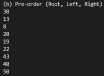

# Tree-Traversals (BST)

🌲 A simple BST (Binary Search Tree) generator written in python

## Installation

Use the package manager [pip](https://pip.pypa.io/en/stable/) to install BST.

## Usage

f.e Useful when we need to create a binary search tree for
```bash
{30, 43, 13, 8, 50, 40, 20, 19, 22}                               
```

<p align="center">
  
  
  
</p>






## Contributing
Pull requests are welcome. For major changes, please open an issue first to discuss what you would like to change.

Please make sure to update tests as appropriate.

## License
[GNU](https://choosealicense.com/licenses/gnu/)
